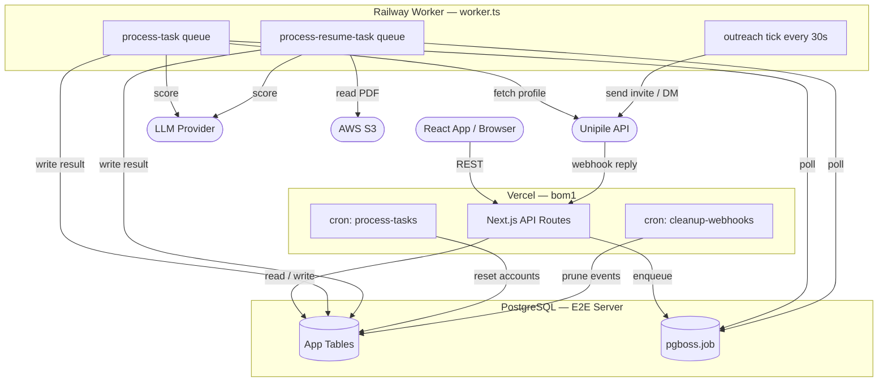

# 01 — Project Overview

> **Rendering diagrams in VS Code**
> The `.md` docs embed Mermaid diagrams. Install the VS Code extension
> **"Markdown Preview Mermaid Support"** (publisher: `bierner.markdown-mermaid`)
> then open any `.md` file and press `Cmd+Shift+V` (Mac) / `Ctrl+Shift+V` (Windows)
> to preview.
>
> For the full database schema, open [`docs/db-diagram.mmd`](./db-diagram.mmd)
> directly — install **"Mermaid Preview"** (`vstirbu.vscode-mermaid-preview`) and
> it renders inline. You can also paste either `.mmd` file into **https://mermaid.live**
> to view and export as SVG/PNG with no extension needed.

## What is this?

**Hirro** (internal name: `salescode-hirro`) is a recruitment-automation tool used by Salescode's internal recruiter and intern teams. It automates three things that would otherwise be manual and slow:

1. **Profile scraping** — paste a list of LinkedIn URLs; the system fetches full profiles via Unipile (a LinkedIn scraping API) using a rotating pool of LinkedIn accounts.
2. **AI scoring** — each scraped profile is evaluated by an LLM against the job's custom scoring rules and ranked automatically.
3. **Outreach** — shortlisted candidates receive LinkedIn connection requests, InMails, or DMs (and eventually email/WhatsApp) on a scheduled sequence, with stage transitions driven both manually and via reply webhooks.

---

## End-to-end flow

```
Recruiter                 Hirro (Vercel)              Railway Worker         Unipile API
─────────                 ──────────────              ──────────────         ───────────
1. Create Requisition ──► POST /api/requisitions
2. Paste LinkedIn URLs──► POST /api/requisitions/:id/candidates
                          Creates Task rows (PENDING)
                          Enqueues jobs → pgboss.job
                                                   ◄── worker picks up
                                                       handleLinkedInJobs()
                                                       GET /linkedin/profile ──► Unipile
                                                       Persist profile data
                                                       analyzeProfile() (LLM)
                                                       Task.status = DONE
3. Recruiter reviews ◄─── GET /api/requisitions/:id/candidates (scored list)
4. Outreach tick ────────────────────────────────────► runOutreachTick() every 30s
                                                       sendInvitation / sendDM ──► Unipile
5. Candidate replies                                                        Unipile sends webhook
                          POST /api/webhooks/unipile ◄───────────────────────────────────
                          markThreadReplied()
                          recomputeTaskStage()
                          Task.stage → REPLIED
```

---

## Who uses it

| Role | What they do |
|---|---|
| Recruiter | Creates requisitions, reviews scored candidates, manages outreach |
| Intern | Pastes LinkedIn URLs in bulk; monitors scoring results |

There is no user authentication system yet — the app is deployed privately and access is controlled at the network/URL level.

---

## Deployment

| Component | Platform | Notes |
|---|---|---|
| Frontend + API routes | **Vercel** (region: `bom1`) | Next.js 16 app router |
| Background worker | **Railway** (free tier) | `worker.ts` via `npm run worker` |
| Database | **PostgreSQL** on E2E server | Owned by Promos team; accessed over TLS |
| pg-boss queue tables | Same PostgreSQL database | Schema `pgboss`, auto-managed |

### Why two backends?

Vercel serverless functions time out after 30–60 seconds and cannot maintain a long-running process. The Railway worker runs `worker.ts` as a persistent Node process that:
- Listens for pg-boss queue jobs (`process-task`, `process-resume-task`)
- Runs the outreach tick loop every 30 seconds

Vercel handles all HTTP traffic; Railway handles all background processing.

---

## Architecture diagram



---

## Repo map

```
bulk-scraper/
├── app/
│   ├── (app)/                  # All UI pages (Next.js App Router)
│   │   ├── page.tsx            # "/" — Jobs / Requisitions list
│   │   ├── jobs/[jobId]/       # Requisition detail (candidates, pipeline, etc.)
│   │   ├── candidates/[taskId] # Single-candidate detail view
│   │   ├── settings/           # App-level settings page
│   │   └── interview/          # LiveKit interview room (separate feature)
│   └── api/                    # All API routes (REST)
│       ├── requisitions/       # CRUD for Requisition + nested resources
│       ├── tasks/              # Per-task actions (enrich, notes, overrides, retry)
│       ├── cron/               # Scheduled maintenance routes
│       ├── webhooks/unipile/   # Inbound reply/acceptance webhook
│       ├── accounts/           # LinkedIn/email sending account management
│       ├── evaluation-configs/ # AI scoring config CRUD
│       ├── jd-templates/       # Job description template CRUD
│       ├── prompt-templates/   # Custom prompt template CRUD
│       └── sheet-integrations/ # Google Sheets export config CRUD
├── lib/
│   ├── prisma.ts               # Extended Prisma client (soft-delete filter)
│   ├── queue.ts                # pg-boss setup + enqueueTaskBatch()
│   ├── analyzer.ts             # LLM scoring orchestration
│   ├── ai-adapter.ts           # Multi-provider LLM client
│   ├── channels/               # Outreach engine (tick, rollup, transitions)
│   ├── workers/                # Job handlers called by worker.ts
│   ├── services/               # account.service.ts, unipile.service.ts
│   └── outreach/               # Template rendering
├── components/
│   ├── jobs/                   # Requisition-detail tab components
│   ├── outreach/               # Kanban pipeline components
│   ├── layout/                 # Sidebar, AppShell
│   └── ui/                     # shadcn/ui primitives
├── scripts/                    # One-off backfill / diagnostic scripts
├── prisma/
│   ├── schema.prisma           # Database schema (source of truth)
│   └── migrations/             # Applied migration files
├── worker.ts                   # Railway entry point
├── vercel.json                 # Cron schedule + region config
└── package.json                # Scripts: dev, build, worker, worker:backfill
```

---

## Tech stack

| Layer | Choice |
|---|---|
| Framework | Next.js 16 (App Router) |
| Language | TypeScript |
| ORM | Prisma 5 + PostgreSQL |
| Job queue | pg-boss 12 (stored in same DB) |
| UI | React 19, Tailwind CSS 4, shadcn/ui, Radix UI |
| Scraping | Unipile API (LinkedIn, WhatsApp) |
| LLM | OpenAI-compatible (configurable provider) |
| File storage | AWS S3 (resume PDFs) |
| Video interviews | LiveKit (separate, experimental feature) |
