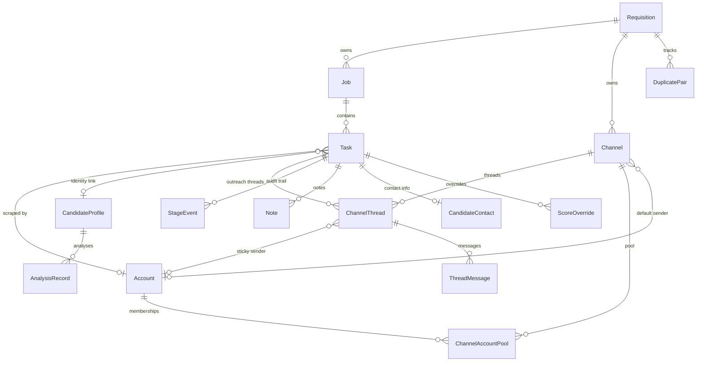

# 02 — Database Schema

**Source of truth:** [prisma/schema.prisma](../prisma/schema.prisma)

The database is PostgreSQL hosted on the E2E server. Prisma 5 is the ORM. All schema changes flow through `prisma migrate` — the `prisma/migrations/` directory is the authoritative migration history.

> **Full visual DB diagram (all tables + fields):** open [`docs/db-diagram.mmd`](./db-diagram.mmd) in VS Code with the **"Mermaid Preview"** extension, or paste its contents into **https://mermaid.live** to get a rendered, exportable diagram.

---

## ER Diagram (live models only)



---

## Models

### Requisition
**File:** [prisma/schema.prisma:155](../prisma/schema.prisma#L155)

A job role. The top-level entity. Each requisition owns its JD and scoring config (stored in the `config` JSON column), all the candidates run against it (via `Job`), and all the outreach channels.

| Field | Type | Notes |
|---|---|---|
| `id` | String (cuid) | PK |
| `title` | String | Role title |
| `department` | String | Department label |
| `recruiterName` | String | Primary recruiter |
| `startDate` | DateTime? | Optional target start |
| `config` | String? (JSON) | JD, scoring rules, AI model, sheet target — the role's long-lived config |
| `archived` | Boolean | Soft-archive (hides from default list) |
| `isActive` | Boolean | Whether role is open; inactive roles suppress outreach |
| `createdAt/updatedAt` | DateTime | Timestamps |

**Relations:** → `Job[]`, `Channel[]`, `DuplicatePair[]`

---

### Job
**File:** [prisma/schema.prisma:173](../prisma/schema.prisma#L173)

A single bulk-analysis run against a Requisition. When a recruiter pastes URLs or uploads resumes, a `Job` row is created and `Task` rows are created inside it.

| Field | Type | Notes |
|---|---|---|
| `id` | String (cuid) | PK |
| `requisitionId` | String? | FK → Requisition (nullable for legacy rows) |
| `status` | JobStatus | PENDING / PROCESSING / COMPLETED / FAILED / CANCELLED / PAUSED |
| `totalTasks` | Int | Count of tasks at creation time |
| `processedCount` | Int | Running counter; when = totalTasks, job is done |
| `successCount` | Int | Count of DONE tasks |
| `failedCount` | Int | Count of FAILED tasks |
| `config` | String? (JSON) | Snapshot of the requisition config at run time — frozen so re-analysis uses the same rules even if the requisition config changes later |

**Relations:** → `Task[]`, `Requisition?`

---

### Task
**File:** [prisma/schema.prisma:203](../prisma/schema.prisma#L203)

**Append-only** (see [docs/10-known-landmines.md](./10-known-landmines.md)). One row per candidate URL or resume file submitted in a Job. The core entity the whole system revolves around.

| Field | Type | Notes |
|---|---|---|
| `id` | String (cuid) | PK |
| `jobId` | String | FK → Job |
| `url` | String (Text) | LinkedIn URL, or placeholder for resume tasks |
| `source` | String | `"linkedin_url"` \| `"resume"` \| `"zip_import"` |
| `sourceFileName` | String? | Original filename for resume/zip tasks |
| `sourceFileUrl` | String? | S3 object key for the source PDF |
| `status` | TaskStatus | PENDING / PROCESSING / DONE / FAILED |
| `result` | String? (JSON) | Raw Unipile profile JSON |
| `analysisResult` | String? (JSON) | AI scoring output (see [docs/04-ai-analysis.md](./04-ai-analysis.md)) |
| `analysisStatus` | AnalysisStatus | PENDING / OK / FAILED — tracks the analysis sub-step separately from `status` |
| `errorMessage` | String? | Last failure reason |
| `retryCount` | Int | Number of pg-boss retries so far |
| `accountId` | String? | FK → Account that scraped this task |
| `contentHash` | String? | SHA-256 of resume text — dedup key for resume imports |
| `stage` | CandidateStage | **Materialized rollup** — never raw-update, use `recomputeTaskStage()` |
| `manualStage` | CandidateStage? | Recruiter override — wins over any derived stage for INTERVIEW / HIRED / REJECTED |
| `stageUpdatedAt` | DateTime | When `stage` last changed |
| `candidateName` | String? | Denormalized from result JSON for log labels |
| `candidateProfileId` | String? | FK → CandidateProfile — cross-task identity join key |
| `deletedAt` | DateTime? | Soft-delete timestamp (see [docs/10-known-landmines.md](./10-known-landmines.md)) |
| `deletedReason` | String? | Why it was soft-deleted |

**Indexes:** `jobId`, `accountId`, `stage`, `contentHash`, `deletedAt`, `candidateProfileId`, `(jobId, analysisStatus)` for the "needs review" query.

---

### Account
**File:** [prisma/schema.prisma:114](../prisma/schema.prisma#L114)

A Unipile-registered LinkedIn, email, or WhatsApp sending account. The system rotates across the pool to spread load and avoid rate limits.

| Field | Type | Notes |
|---|---|---|
| `id` | String (cuid) | PK |
| `accountId` | String (unique) | Unipile's own `account_id` — used in every API call |
| `name` | String | Human-friendly label |
| `type` | AccountType | LINKEDIN / EMAIL / WHATSAPP |
| `dsn` / `apiKey` | String? | Per-account Unipile DSN + key (overrides env vars) |
| `status` | AccountStatus | ACTIVE / BUSY / COOLDOWN / DISABLED |
| `dailyCount` | Int | Sends today — reset at end-of-day |
| `dailyResetAt` | DateTime? | When to reset `dailyCount` |
| `weeklyCount` | Int | LinkedIn invites this week — enforces ~100/week limit |
| `weeklyResetAt` | DateTime? | When to reset `weeklyCount` |
| `warmupUntil` | DateTime? | While active, effective daily cap = `WARMUP_DAILY_CAP` (ramp for new accounts) |
| `minuteCount` / `minuteResetAt` | Int / DateTime? | Per-minute rate limiting |
| `cooldownUntil` | DateTime? | When COOLDOWN expires |
| `deletedAt` | DateTime? | Soft-delete — excluded from pool but FK references preserved |

---

### Channel
**File:** [prisma/schema.prisma:320](../prisma/schema.prisma#L320)

One outreach channel per `(requisition, type)`. The `config` JSON column holds channel-specific rules (invite templates, followup sequences, score thresholds) — see [lib/channels/types.ts](../lib/channels/types.ts) for the schema.

| Field | Type | Notes |
|---|---|---|
| `id` | String (cuid) | PK |
| `requisitionId` | String | FK → Requisition |
| `type` | ChannelType | LINKEDIN / EMAIL / WHATSAPP |
| `status` | ChannelStatus | ACTIVE / PAUSED / ARCHIVED |
| `config` | Json | Channel rules — invite templates, followup sequences, score bands |
| `sendingAccountId` | String? | Default sending account (fallback when pool is empty) |
| `dailyCap` | Int | Max sends/day for this channel (default 20) |
| `dailyInMailCap` | Int | Max InMails/day (default 5 — credits are expensive) |

---

### ChannelThread
**File:** [prisma/schema.prisma:367](../prisma/schema.prisma#L367)

One row per `(task, channel)`. Tracks the full outreach lifecycle for one candidate on one channel. `nextActionAt` is the sole scheduling key — the outreach tick claims all threads where `nextActionAt <= now`.

| Field | Type | Notes |
|---|---|---|
| `id` | String (cuid) | PK |
| `taskId` | String | FK → Task |
| `channelId` | String | FK → Channel |
| `channelType` | ChannelType | Denormalized for cron filter without JOIN |
| `status` | ThreadStatus | PENDING / ACTIVE / REPLIED / PAUSED / ARCHIVED |
| `providerState` | Json? | Phase sub-state: `{ phase: "INVITE_PENDING" \| "CONNECTED" \| "MESSAGED" \| ... }` |
| `nextActionAt` | DateTime? | **THE scheduling key** — cron scans this |
| `followupsSent` / `followupsTotal` | Int | Progress through the followup sequence |
| `providerChatId` | String? | Unipile chat ID for DMs / WhatsApp |
| `providerThreadId` | String? | Email thread ID (for reply threading) |
| `accountId` | String? | **Sticky** — set at first send, never re-derived |
| `candidateProviderId` | String? | LinkedIn provider_id — indexed for O(1) webhook lookup |
| `consecutiveFailures` | Int | Circuit-breaker counter; archives thread at threshold 5 |
| `lastInboundAt` | DateTime? | WhatsApp 24h window anchor |
| `pendingSendKey` / `pendingSendStartedAt` | String? / DateTime? | Crash-recovery forensic marker |

**Unique:** `(taskId, channelId)` — one thread per candidate per channel.

---

### ThreadMessage
**File:** [prisma/schema.prisma:430](../prisma/schema.prisma#L430)

One row per outbound message sent. Immutable send record. `accountId` is frozen at send time for audit purposes.

| Field | Type | Notes |
|---|---|---|
| `threadId` | String | FK → ChannelThread |
| `type` | OutreachType | INVITE / INMAIL / FIRST_DM / EMAIL / FOLLOWUP / WHATSAPP |
| `renderedBody` | String (Text) | Actual text sent (after template rendering) |
| `providerMessageId` | String? | Unique constraint with `threadId` — deduplicates provider retries |
| `accountId` | String? | Frozen-at-send sending account |

---

### CandidateProfile
**File:** [prisma/schema.prisma:553](../prisma/schema.prisma#L553)

Canonical per-person record. Multiple `Task` rows (across different requisitions) may link to the same `CandidateProfile` via `canonicalLinkedinUrl`. This is the cross-task identity join key.

| Field | Type | Notes |
|---|---|---|
| `linkedinUrl` | String | Raw URL as submitted |
| `canonicalLinkedinUrl` | String? | Normalized form used for dedup (`lib/canonicalize-url.ts`) |
| `rawProfile` | String? (Text) | Full Unipile JSON — nullable (cleared for old rows on free tier to save space) |

---

### AnalysisRecord
**File:** [prisma/schema.prisma:575](../prisma/schema.prisma#L575)

One row per scored analysis. Stores the complete scoring output, job context, and summary fields (denormalized for sorting/dashboard queries). Written inside the same transaction as `Task.status = DONE`.

---

### StageEvent
**File:** [prisma/schema.prisma:494](../prisma/schema.prisma#L494)

Immutable audit log of every `Task.stage` change. Written by the Postgres trigger `task_stage_audit` and by `recomputeTaskStage()` via `markStageEventExplicit()`.

| Field | Notes |
|---|---|
| `fromStage / toStage` | The transition |
| `actor` | `USER \| SYSTEM \| RULE \| WEBHOOK` |
| `reason` | Human-readable reason string |

---

### DuplicatePair
**File:** [prisma/schema.prisma:265](../prisma/schema.prisma#L265)

Detected duplicate candidates within a requisition. `kind` is `LINKEDIN_URL` (same URL) or `RESUME_HASH` (same `contentHash`). Resolved via the Duplicates UI — resolving soft-deletes one of the pair's Tasks.

---

### CandidateContact
**File:** [prisma/schema.prisma:520](../prisma/schema.prisma#L520)

Enriched contact info for a Task. One-to-one with `Task`. Used by email and WhatsApp channels to get the recipient address/phone.

| Field | Notes |
|---|---|
| `email / workEmail / personalEmail` | Email addresses from various enrichment sources |
| `phone` | E.164 phone for WhatsApp |
| `source` | `UNIPILE \| WIZA \| APOLLO \| AIRSCALE \| MANUAL` |

---

### Other Models (config/settings)

| Model | Purpose |
|---|---|
| `JdTemplate` | Saved JD + scoring rule presets the recruiter can load into a new requisition |
| `PromptTemplate` | Saved prompt text templates |
| `EvaluationConfig` | Full scoring config presets (rules, prompts, rule overrides) |
| `AppSettings` | Global singleton (`id = "global"`) — default AI model, provider, sheet URL, score threshold |
| `AiProvider` | Configured LLM providers (OpenAI-compatible, Anthropic, Bedrock) |
| `SheetIntegration` | Named Google Sheets export URLs |
| `WebhookEvent` | Deduplication table for Unipile webhook deliveries — prevents double-processing retries |
| `StageSnapshot` | Daily stage-distribution snapshot per requisition — anomaly detection for mass-reset incidents |
| `GdprErasure` | Audit log of bulk-erase operations (stores a snapshot of erased identifiers; the data itself is deleted) |
| `OutreachMessage` | **Legacy** — belongs to old campaign system. Kept for historical inbound reply attribution. Not written by new outreach paths. |

---

## Foreign key summary

| Child | FK Column | Parent |
|---|---|---|
| Job | requisitionId | Requisition |
| Task | jobId | Job |
| Task | accountId | Account |
| Task | candidateProfileId | CandidateProfile |
| Channel | requisitionId | Requisition |
| Channel | sendingAccountId | Account |
| ChannelThread | taskId | Task |
| ChannelThread | channelId | Channel |
| ChannelThread | accountId | Account (sticky sender) |
| ThreadMessage | threadId | ChannelThread |
| ThreadMessage | accountId | Account |
| ChannelAccountPool | channelId | Channel |
| ChannelAccountPool | accountId | Account |
| AnalysisRecord | candidateId | CandidateProfile |
| DuplicatePair | taskAId / taskBId | Task |
| DuplicatePair | requisitionId | Requisition |
| CandidateContact | taskId | Task |
| ScoreOverride | taskId | Task |
| StageEvent | taskId | Task |
| Note | taskId | Task |

Most child→parent relationships use `onDelete: Cascade`.

---

## Soft-delete filter (Task only)

The Prisma client in [lib/prisma.ts](../lib/prisma.ts) automatically injects `{ deletedAt: null }` into every `task.findMany`, `task.findFirst`, `task.findFirstOrThrow`, and `task.count`. `findUnique` is intentionally NOT filtered — PK lookups are explicit and deliberate.

To query deleted tasks (e.g., an admin view):
```ts
prisma.task.findMany({ where: { deletedAt: { not: null } } })
```

---

## Postgres trigger: task_stage_audit

Defined in a migration file. Fires `AFTER UPDATE OF stage ON "Task"`. Auto-inserts a `StageEvent` row whenever `Task.stage` changes, providing an audit trail even if application code bypasses `recomputeTaskStage()`. The explicit `markStageEventExplicit()` context flag suppresses the trigger when `recomputeTaskStage()` is about to write its own `StageEvent` (preventing duplicate rows).

---

## Notable indexes

| Table | Index | Why |
|---|---|---|
| ChannelThread | `(status, nextActionAt)` | Hot path — outreach tick scans this every 30s |
| ChannelThread | `(candidateProviderId, status)` | O(1) webhook lookup for `new_relation` events |
| Task | `(jobId, analysisStatus)` | "Needs review" recruiter query |
| Task | `deletedAt` | Soft-delete filter efficiency |
| Account | `deletedAt` | Exclude soft-deleted from pool queries |
| Requisition | `archived` | Default list filter |
